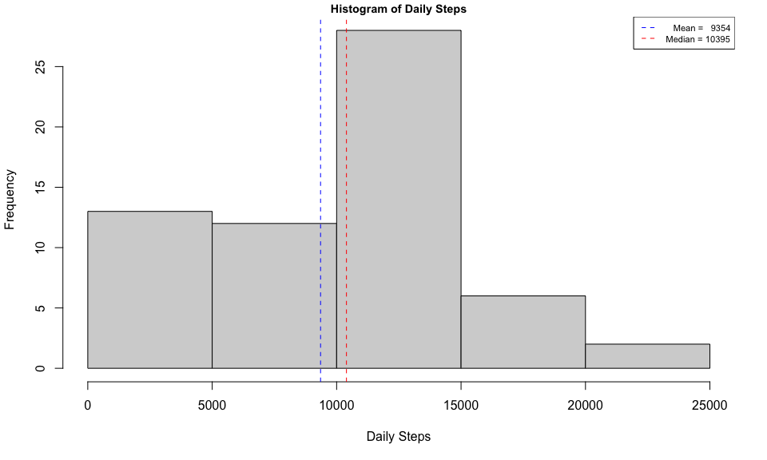

## Loading & preprocessing data

Read csv

```r
library(dplyr)
unzip("activity.zip", exdir = getwd())
act <- "activity.csv" %>% read.csv()
str(act)
```

```
## 'data.frame':	17568 obs. of  3 variables:
##  $ steps   : int  NA NA NA NA NA NA NA NA NA NA ...
##  $ date    : chr  "2012-10-01" "2012-10-01" "2012-10-01" "2012-10-01" ...
##  $ interval: int  0 5 10 15 20 25 30 35 40 45 ...
```

Check for missing values

```r
colSums(is.na(act))
```

```
##    steps     date interval 
##     2304        0        0
```

Preprocess data

```r
# helper function to convert intervals to time string (e.g. 5 -> "00:05")
to_time_str <- function(number) {
    missing_zeros <- paste(rep("0",4-nchar(number)), collapse = "")
    padded_number <- paste0(missing_zeros, number)
    sub("(\\d{2})(\\d{2})", "\\1:\\2", padded_number) # add colon
}

act <- mutate(act,
        date = as.Date(date),
        interval = interval %>% sapply(to_time_str) %>% factor,
        weekday = weekdays(date),
        is_weekend = weekdays(date) %in% c("Saturday", "Sunday")
    )
intervals <- levels(act$interval)
str(act)
```

```
## 'data.frame':	17568 obs. of  5 variables:
##  $ steps     : int  NA NA NA NA NA NA NA NA NA NA ...
##  $ date      : Date, format: "2012-10-01" "2012-10-01" ...
##  $ interval  : Factor w/ 288 levels "00:00","00:05",..: 1 2 3 4 5 6 7 8 9 10 ...
##  $ weekday   : chr  "Monday" "Monday" "Monday" "Monday" ...
##  $ is_weekend: logi  FALSE FALSE FALSE FALSE FALSE FALSE ...
```

## Histogram of daily steps


```r
# function to plot histogram of steps (supports multiple plots)
hist_steps <- function(act_df, title) {
    # calculate number of steps per day
    res <- summarize(act_df, daily_steps = sum(steps, na.rm = T), .by = date)
    
    # plot histogram
    par(mar = c(5.1, 4.1, 1.1, 2.1))
    
    hist(res$daily_steps, xlab = "Daily Steps", main = title, cex.main = 0.9)
    
    # add mean line
    mean_value <- mean(res$daily_steps)
    mean_label <- paste("   Mean","=  ", round(mean_value))
    mean_color <- "blue"
    abline(v = mean_value, lty = 2, col = mean_color)
    
    # add median line
    median_value <- median(res$daily_steps)
    median_label <- paste("Median","=", round(median_value))
    median_color <- "red"
    abline(v = median_value, lty = 2, col = median_color)
    
    # add legend
    legend("topright", legend = c(mean_label, median_label),
           lty = 2, cex = 0.7, col = c(mean_color, median_color))
}

hist_steps(act, "Histogram of Daily Steps")
```

<!-- -->

## Average daily activity pattern


```r
time_axis <- function(tick_increment) {
    xticks <- seq(from = 1, to = length(intervals)+1, by = 60*tick_increment/5)
    axis(1, at = xticks, labels = intervals[xticks], cex.axis = 0.7)
}

plot_daily_activity <- function(act_df, title) {
    par(mar = c(1.5, 2.5, 2, 2), mgp = c(1.5, 0.5, 0))
    res <- summarize(act_df, avg_steps = mean(steps, na.rm = T), .by = interval)
    plot(avg_steps ~ interval, res,
         xlab = "",
         ylab = "Average Steps",
         main = title,
         cex.lab = 0.7, cex.axis = 0.7, cex.main = 0.7, xaxt = "n")
    time_axis(tick_increment = 1)
    points(avg_steps ~ interval, res, type = "l")
    points(avg_steps ~ interval, res, type = "p", pch = 1, cex = .5, col = "coral3")
    max_point <- filter(res, avg_steps == max(avg_steps))
    text(max_point$interval, max_point$avg_steps,
         labels = paste(round(max_point$avg_steps), "steps at", max_point$interval),
         pos = 4, cex = 0.7)
}

plot_daily_activity(act, "Daily Activity")
```

<!-- -->

## 6. Impute missing data

Visualize steps data across intervals and dates


```r
#Returns red for NA, white for 0, and lightgray to black for >0
number_of_colors <- max(na.omit(act$steps)) + 1
gradient <- colorRampPalette(c("lightgray", "black"))(number_of_colors)
colorscale <- function(x) ifelse(is.na(x), "red", ifelse(x == 0, "white", gradient[x + 1]))

plot_raw <- function(act_df, title, axes = F) {
    ifelse(axes, par(mar = c(2,2,2,2), mgp = c(0.2, 0.5, 0)), par(mar = c(0, 0, 1.5, 0)))
    plot(date ~ interval, act_df,
         xlab = ifelse(axes,"Time",""), ylab = "", main = title, cex.main = 1,
         col = colorscale(steps),
         pch = 15, cex = .2, xaxt = "n", yaxt = ifelse(axes, "s", "n"), cex.axis = 0.7, cex.lab = 0.7
         )
}

plot_raw(act, "Raw data", axes = T)
```

<!-- -->

The missing steps data seems to be located in 8 completely missing days.


```r
dates_status <- act %>%
    summarize(missing = is.na(all(steps)), .by = date) %>%
    mutate(weekday = weekdays(date))
table(select(dates_status, missing, weekday))
```

```
##        weekday
## missing Friday Monday Saturday Sunday Thursday Tuesday Wednesday
##   FALSE      7      7        7      7        8       9         8
##   TRUE       2      2        1      1        1       0         1
```

```r
missing_dates <- filter(dates_status, missing == T)
```
Use the average of the non-missing days to impute the missing days.

```r
impute <- function(imp_fun, act_df) {
    act_imp <- data.frame(act_df)
    summ <- summarize(act_imp, steps = imp_fun(steps, na.rm = T), .by = c(weekday, interval))
    summ$steps <- round(summ$steps)
    for (i in 1:nrow(missing_dates))
        act_imp$steps[act_imp$date == missing_dates$date[i]] = 
            filter(summ, weekday == missing_dates$weekday[i])$steps
    act_imp
}

par(mfrow = c(1,3))
plot_raw(act, "Raw data (with missing days)")
plot_raw(impute(mean, act), "Imputed with MEAN")
plot_raw(impute(median, act), "Imputed with MEDIAN")
```

<!-- -->

The `mean` smears the data across the intervals. The `median` looks more natural (closer to real data), so it will be used instead.


```r
act_imp <- impute(median, act)
```

## 7. Histogram of the total number of steps taken each day after missing values are imputed


```r
par(mfrow = c(1,2))
hist_steps(act, "Original Data")
hist_steps(act_imp, "Imputed Data")
```

<!-- -->

The histogram of the imputed data (`act_imp`) looks similar to the original, however the `mean` shifted slightly right.

## 8. Are there differences in activity patterns between weekdays and weekends?


```r
par(mfrow = c(2,1))
plot_daily_activity(filter(act_imp, !is_weekend), "WEEKDAY Daily Activity")
plot_daily_activity(filter(act_imp, is_weekend), "WEEKEND Daily Activity")
```

<!-- -->

Weekdays have the highest average steps (8am-9am), and smaller peaks around 12pm, 4pm, and 6pm-7pm.  
Weekends activity is more evenly distributed between the highest peak (around 9am) to the last peak (around 8pm).
